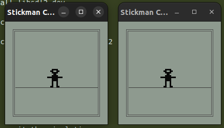
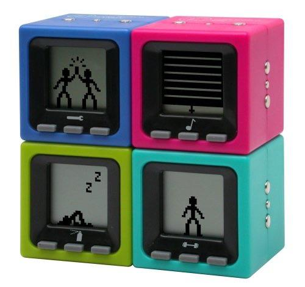

# Cube-World-Toy-Simulation

A fun SDL2-based toy simulation featuring animated stickmen in multiple windows. Stickmen can animate, blink, sway, and interact when windows are docked together. The project demonstrates basic animation, window management, and pixel art rendering in C++ using SDL2.

## Features
- Animated stickman with hands and multiple poses
- Multi-window support with interactive docking
- Customizable colors for background and stickman
- Simple pixel art rendering

## How to Build
1. Make sure you have SDL2 development libraries installed:
   ```sh
   sudo apt-get install libsdl2-dev
   ```
2. Compile the project:
   ```sh
   g++ stickman_art.cpp -o stickman_art -lSDL2
   ```

## How to Run
```sh
./stickman_art
```

## Controls
- Close any window to exit the simulation.
- Move windows close together to see the docking animation.
## Current state


## Goal I want to simulate


## License
See [LICENSE](LICENSE).